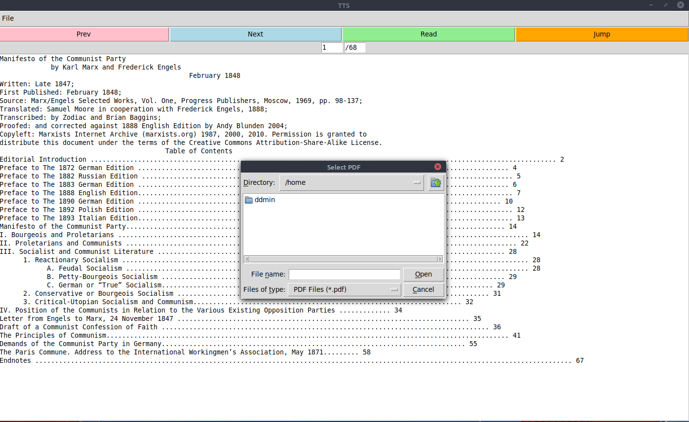

# TTS

A TTS gui powered by gTTS api.
(because I hate reading)

## Dependencies
- gTTS (obviously)
- tkinter (GUI)
- pdftotext (reading PDFs)
    - poppler
- mpv (for playing back files)

## Also Included
- ocr: convert image PDF to TXT
- tts_old: save voice to mp3 file (probably doesn't work anymore)

Note: TTS stands for *Terrible Text Synthesizer*, which is a backcronym created to avoid confusion and possible lawsuits just kidding no one's gonna see this
